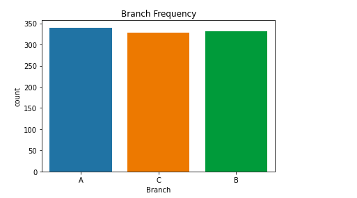
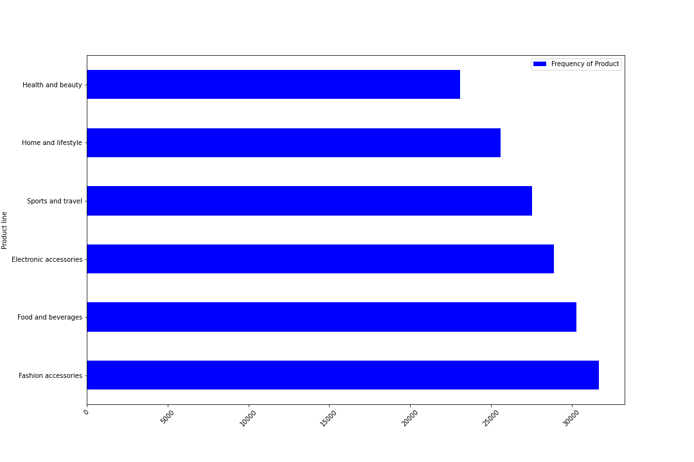
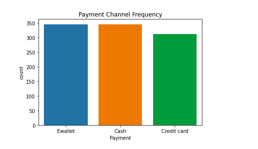
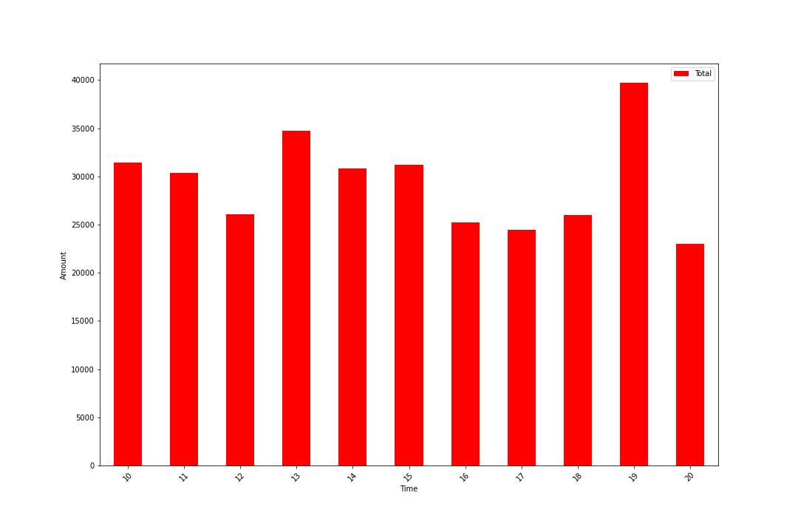

> **The dataset is one of the historical sales of supermarket company which has recorded in 3 different branches for 3 months data**

> **Before starting, download [Anaconda Navigator](https://docs.anaconda.com/anaconda/navigator/) & [Jupyter Notebook Editor](https://docs.anaconda.com/anaconda/navigator/) & the Supermarket dataset [here](https://www.kaggle.com/aungpyaeap/supermarket-sales)**


```python
import numpy as np 
import pandas as pd 
import matplotlib.pyplot as plt
from pandas import DataFrame
import seaborn as sns
```


```python
df = pd.read_csv('supermarket.csv') # read the file to visualize.
df.head(5)
```

<table border="1" class="dataframe">
  <thead>
    <tr style="text-align: right;">
      <th></th>
      <th>Invoice ID</th>
      <th>Branch</th>
      <th>City</th>
      <th>Customer type</th>
      <th>Gender</th>
      <th>Product line</th>
      <th>Unit price</th>
      <th>Quantity</th>
      <th>Tax 5%</th>
      <th>Total</th>
      <th>Date</th>
      <th>Time</th>
      <th>Payment</th>
      <th>cogs</th>
      <th>gross margin percentage</th>
      <th>gross income</th>
      <th>Rating</th>
    </tr>
  </thead>
  <tbody>
    <tr>
      <th>0</th>
      <td>750-67-8428</td>
      <td>A</td>
      <td>Yangon</td>
      <td>Member</td>
      <td>Female</td>
      <td>Health and beauty</td>
      <td>74.69</td>
      <td>7</td>
      <td>26.1415</td>
      <td>548.9715</td>
      <td>1/5/2019</td>
      <td>13:08</td>
      <td>Ewallet</td>
      <td>522.83</td>
      <td>4.761905</td>
      <td>26.1415</td>
      <td>9.1</td>
    </tr>
    <tr>
      <th>1</th>
      <td>226-31-3081</td>
      <td>C</td>
      <td>Naypyitaw</td>
      <td>Normal</td>
      <td>Female</td>
      <td>Electronic accessories</td>
      <td>15.28</td>
      <td>5</td>
      <td>3.8200</td>
      <td>80.2200</td>
      <td>3/8/2019</td>
      <td>10:29</td>
      <td>Cash</td>
      <td>76.40</td>
      <td>4.761905</td>
      <td>3.8200</td>
      <td>9.6</td>
    </tr>
    <tr>
      <th>2</th>
      <td>631-41-3108</td>
      <td>A</td>
      <td>Yangon</td>
      <td>Normal</td>
      <td>Male</td>
      <td>Home and lifestyle</td>
      <td>46.33</td>
      <td>7</td>
      <td>16.2155</td>
      <td>340.5255</td>
      <td>3/3/2019</td>
      <td>13:23</td>
      <td>Credit card</td>
      <td>324.31</td>
      <td>4.761905</td>
      <td>16.2155</td>
      <td>7.4</td>
    </tr>
    <tr>
      <th>3</th>
      <td>123-19-1176</td>
      <td>A</td>
      <td>Yangon</td>
      <td>Member</td>
      <td>Male</td>
      <td>Health and beauty</td>
      <td>58.22</td>
      <td>8</td>
      <td>23.2880</td>
      <td>489.0480</td>
      <td>1/27/2019</td>
      <td>20:33</td>
      <td>Ewallet</td>
      <td>465.76</td>
      <td>4.761905</td>
      <td>23.2880</td>
      <td>8.4</td>
    </tr>
    <tr>
      <th>4</th>
      <td>373-73-7910</td>
      <td>A</td>
      <td>Yangon</td>
      <td>Normal</td>
      <td>Male</td>
      <td>Sports and travel</td>
      <td>86.31</td>
      <td>7</td>
      <td>30.2085</td>
      <td>634.3785</td>
      <td>2/8/2019</td>
      <td>10:37</td>
      <td>Ewallet</td>
      <td>604.17</td>
      <td>4.761905</td>
      <td>30.2085</td>
      <td>5.3</td>
    </tr>
  </tbody>
</table>
</div>


```python
df.Branch.unique()
```


    array(['A', 'C', 'B'], dtype=object)


> To specificially observe the data of Females in Mandalay who have shopped a Quantity of more than 1


```python
new_df = df.loc[(df['City'] == 'Mandalay') & (df['Gender'] == 'Female') & (df['Quantity'] > 1)]
new_df.head(5)
```


<table border="1" class="dataframe">
  <thead>
    <tr style="text-align: right;">
      <th></th>
      <th>Invoice ID</th>
      <th>Branch</th>
      <th>City</th>
      <th>Customer type</th>
      <th>Gender</th>
      <th>Product line</th>
      <th>Unit price</th>
      <th>Quantity</th>
      <th>Tax 5%</th>
      <th>Total</th>
      <th>Date</th>
      <th>Time</th>
      <th>Payment</th>
      <th>cogs</th>
      <th>gross margin percentage</th>
      <th>gross income</th>
      <th>Rating</th>
    </tr>
  </thead>
  <tbody>
    <tr>
      <th>9</th>
      <td>692-92-5582</td>
      <td>B</td>
      <td>Mandalay</td>
      <td>Member</td>
      <td>Female</td>
      <td>Food and beverages</td>
      <td>54.84</td>
      <td>3</td>
      <td>8.226</td>
      <td>172.746</td>
      <td>2/20/2019</td>
      <td>13:27</td>
      <td>Credit card</td>
      <td>164.52</td>
      <td>4.761905</td>
      <td>8.226</td>
      <td>5.9</td>
    </tr>
    <tr>
      <th>10</th>
      <td>351-62-0822</td>
      <td>B</td>
      <td>Mandalay</td>
      <td>Member</td>
      <td>Female</td>
      <td>Fashion accessories</td>
      <td>14.48</td>
      <td>4</td>
      <td>2.896</td>
      <td>60.816</td>
      <td>2/6/2019</td>
      <td>18:07</td>
      <td>Ewallet</td>
      <td>57.92</td>
      <td>4.761905</td>
      <td>2.896</td>
      <td>4.5</td>
    </tr>
    <tr>
      <th>15</th>
      <td>299-46-1805</td>
      <td>B</td>
      <td>Mandalay</td>
      <td>Member</td>
      <td>Female</td>
      <td>Sports and travel</td>
      <td>93.72</td>
      <td>6</td>
      <td>28.116</td>
      <td>590.436</td>
      <td>1/15/2019</td>
      <td>16:19</td>
      <td>Cash</td>
      <td>562.32</td>
      <td>4.761905</td>
      <td>28.116</td>
      <td>4.5</td>
    </tr>
    <tr>
      <th>19</th>
      <td>319-50-3348</td>
      <td>B</td>
      <td>Mandalay</td>
      <td>Normal</td>
      <td>Female</td>
      <td>Home and lifestyle</td>
      <td>40.30</td>
      <td>2</td>
      <td>4.030</td>
      <td>84.630</td>
      <td>3/11/2019</td>
      <td>15:30</td>
      <td>Ewallet</td>
      <td>80.60</td>
      <td>4.761905</td>
      <td>4.030</td>
      <td>4.4</td>
    </tr>
    <tr>
      <th>28</th>
      <td>145-94-9061</td>
      <td>B</td>
      <td>Mandalay</td>
      <td>Normal</td>
      <td>Female</td>
      <td>Food and beverages</td>
      <td>88.36</td>
      <td>5</td>
      <td>22.090</td>
      <td>463.890</td>
      <td>1/25/2019</td>
      <td>19:48</td>
      <td>Cash</td>
      <td>441.80</td>
      <td>4.761905</td>
      <td>22.090</td>
      <td>9.6</td>
    </tr>
  </tbody>
</table>
</div>


#### To concentrate only specific columns and plot them
#### In this case we will observe Branch frequency of specific branches


```python
import seaborn as sns
sns.countplot(x="Branch", data = df).set_title("Branch Frequency") 
```


    Text(0.5, 1.0, 'Branch Frequency')





### In this section we will create a new column for frequency of each product


```python
df['Frequency of Product'] = df['Product line'].map(df['Product line'].value_counts())
df.head(4)
```


</style>
<table border="1" class="dataframe">
  <thead>
    <tr style="text-align: right;">
      <th></th>
      <th>Invoice ID</th>
      <th>Branch</th>
      <th>City</th>
      <th>Customer type</th>
      <th>Gender</th>
      <th>Product line</th>
      <th>Unit price</th>
      <th>Quantity</th>
      <th>Tax 5%</th>
      <th>Total</th>
      <th>Date</th>
      <th>Time</th>
      <th>Payment</th>
      <th>cogs</th>
      <th>gross margin percentage</th>
      <th>gross income</th>
      <th>Rating</th>
      <th>Frequency of Product</th>
    </tr>
  </thead>
  <tbody>
    <tr>
      <th>0</th>
      <td>750-67-8428</td>
      <td>A</td>
      <td>Yangon</td>
      <td>Member</td>
      <td>Female</td>
      <td>Health and beauty</td>
      <td>74.69</td>
      <td>7</td>
      <td>26.1415</td>
      <td>548.9715</td>
      <td>1/5/2019</td>
      <td>13:08</td>
      <td>Ewallet</td>
      <td>522.83</td>
      <td>4.761905</td>
      <td>26.1415</td>
      <td>9.1</td>
      <td>152</td>
    </tr>
    <tr>
      <th>1</th>
      <td>226-31-3081</td>
      <td>C</td>
      <td>Naypyitaw</td>
      <td>Normal</td>
      <td>Female</td>
      <td>Electronic accessories</td>
      <td>15.28</td>
      <td>5</td>
      <td>3.8200</td>
      <td>80.2200</td>
      <td>3/8/2019</td>
      <td>10:29</td>
      <td>Cash</td>
      <td>76.40</td>
      <td>4.761905</td>
      <td>3.8200</td>
      <td>9.6</td>
      <td>170</td>
    </tr>
    <tr>
      <th>2</th>
      <td>631-41-3108</td>
      <td>A</td>
      <td>Yangon</td>
      <td>Normal</td>
      <td>Male</td>
      <td>Home and lifestyle</td>
      <td>46.33</td>
      <td>7</td>
      <td>16.2155</td>
      <td>340.5255</td>
      <td>3/3/2019</td>
      <td>13:23</td>
      <td>Credit card</td>
      <td>324.31</td>
      <td>4.761905</td>
      <td>16.2155</td>
      <td>7.4</td>
      <td>160</td>
    </tr>
    <tr>
      <th>3</th>
      <td>123-19-1176</td>
      <td>A</td>
      <td>Yangon</td>
      <td>Member</td>
      <td>Male</td>
      <td>Health and beauty</td>
      <td>58.22</td>
      <td>8</td>
      <td>23.2880</td>
      <td>489.0480</td>
      <td>1/27/2019</td>
      <td>20:33</td>
      <td>Ewallet</td>
      <td>465.76</td>
      <td>4.761905</td>
      <td>23.2880</td>
      <td>8.4</td>
      <td>152</td>
    </tr>
  </tbody>
</table>
</div>


### In this section we will create a dataframe derived from the major dataframe 'df' to focus on frequency of product and the product


```python
forbranchfreq = df[['Product line','Frequency of Product']]
forbranchfreq.head(5)
```


<div>

<table border="1" class="dataframe">
  <thead>
    <tr style="text-align: right;">
      <th></th>
      <th>Product line</th>
      <th>Frequency of Product</th>
    </tr>
  </thead>
  <tbody>
    <tr>
      <th>0</th>
      <td>Health and beauty</td>
      <td>152</td>
    </tr>
    <tr>
      <th>1</th>
      <td>Electronic accessories</td>
      <td>170</td>
    </tr>
    <tr>
      <th>2</th>
      <td>Home and lifestyle</td>
      <td>160</td>
    </tr>
    <tr>
      <th>3</th>
      <td>Health and beauty</td>
      <td>152</td>
    </tr>
    <tr>
      <th>4</th>
      <td>Sports and travel</td>
      <td>166</td>
    </tr>
  </tbody>
</table>
</div>


#### In this section we will group the frequencies in order to derive unique values of the product that we can plot sefully later and also sort it from first to last


```python
forbranchfreq100 = forbranchfreq.groupby(['Product line']).sum()
forbranchfreq120 = forbranchfreq100.sort_values(by=['Frequency of Product'],  ascending=False)
forbranchfreq120 = DataFrame.drop_duplicates(forbranchfreq120)
forbranchfreq120.head(3)
```


<div>
<table border="1" class="dataframe">
  <thead>
    <tr style="text-align: right;">
      <th></th>
      <th>Frequency of Product</th>
    </tr>
    <tr>
      <th>Product line</th>
      <th></th>
    </tr>
  </thead>
  <tbody>
    <tr>
      <th>Fashion accessories</th>
      <td>31684</td>
    </tr>
    <tr>
      <th>Food and beverages</th>
      <td>30276</td>
    </tr>
    <tr>
      <th>Electronic accessories</th>
      <td>28900</td>
    </tr>
  </tbody>
</table>
</div>


### In this section we wil plot the new grouped and sorted dataframe of product and the frequency. We derive from this that Fashions and accessories come first and Health and beauty products come last

> this can inform supermarket management to put rackets of fashions and accesories at the door of the supermarket
because they are a best-seller


```python
forbranchfreq120.plot(kind="barh", color = 'blue',figsize=(15,10))
plt.xticks(rotation=45);
plt.savefig("figure1.png")
```





### Plot to count frequency of Payment Channel using seaborn plotting library


```python
sns.countplot(x="Payment", data = df).set_title("Payment Channel Frequency") 
```


    Text(0.5, 1.0, 'Payment Channel Frequency')





#### In this section we will determine the most active times in which customers shop at the supermarket.
#### We will derive only the hour from the time column by stripping the column


```python
df['STime'] = df['Time'].str[:2]
df.head(5)
```


<div>
<table border="1" class="dataframe">
  <thead>
    <tr style="text-align: right;">
      <th></th>
      <th>Invoice ID</th>
      <th>Branch</th>
      <th>City</th>
      <th>Customer type</th>
      <th>Gender</th>
      <th>Product line</th>
      <th>Unit price</th>
      <th>Quantity</th>
      <th>Tax 5%</th>
      <th>Total</th>
      <th>Date</th>
      <th>Time</th>
      <th>Payment</th>
      <th>cogs</th>
      <th>gross margin percentage</th>
      <th>gross income</th>
      <th>Rating</th>
      <th>Frequency of Product</th>
      <th>STime</th>
    </tr>
  </thead>
  <tbody>
    <tr>
      <th>0</th>
      <td>750-67-8428</td>
      <td>A</td>
      <td>Yangon</td>
      <td>Member</td>
      <td>Female</td>
      <td>Health and beauty</td>
      <td>74.69</td>
      <td>7</td>
      <td>26.1415</td>
      <td>548.9715</td>
      <td>1/5/2019</td>
      <td>13:08</td>
      <td>Ewallet</td>
      <td>522.83</td>
      <td>4.761905</td>
      <td>26.1415</td>
      <td>9.1</td>
      <td>152</td>
      <td>13</td>
    </tr>
    <tr>
      <th>1</th>
      <td>226-31-3081</td>
      <td>C</td>
      <td>Naypyitaw</td>
      <td>Normal</td>
      <td>Female</td>
      <td>Electronic accessories</td>
      <td>15.28</td>
      <td>5</td>
      <td>3.8200</td>
      <td>80.2200</td>
      <td>3/8/2019</td>
      <td>10:29</td>
      <td>Cash</td>
      <td>76.40</td>
      <td>4.761905</td>
      <td>3.8200</td>
      <td>9.6</td>
      <td>170</td>
      <td>10</td>
    </tr>
    <tr>
      <th>2</th>
      <td>631-41-3108</td>
      <td>A</td>
      <td>Yangon</td>
      <td>Normal</td>
      <td>Male</td>
      <td>Home and lifestyle</td>
      <td>46.33</td>
      <td>7</td>
      <td>16.2155</td>
      <td>340.5255</td>
      <td>3/3/2019</td>
      <td>13:23</td>
      <td>Credit card</td>
      <td>324.31</td>
      <td>4.761905</td>
      <td>16.2155</td>
      <td>7.4</td>
      <td>160</td>
      <td>13</td>
    </tr>
    <tr>
      <th>3</th>
      <td>123-19-1176</td>
      <td>A</td>
      <td>Yangon</td>
      <td>Member</td>
      <td>Male</td>
      <td>Health and beauty</td>
      <td>58.22</td>
      <td>8</td>
      <td>23.2880</td>
      <td>489.0480</td>
      <td>1/27/2019</td>
      <td>20:33</td>
      <td>Ewallet</td>
      <td>465.76</td>
      <td>4.761905</td>
      <td>23.2880</td>
      <td>8.4</td>
      <td>152</td>
      <td>20</td>
    </tr>
    <tr>
      <th>4</th>
      <td>373-73-7910</td>
      <td>A</td>
      <td>Yangon</td>
      <td>Normal</td>
      <td>Male</td>
      <td>Sports and travel</td>
      <td>86.31</td>
      <td>7</td>
      <td>30.2085</td>
      <td>634.3785</td>
      <td>2/8/2019</td>
      <td>10:37</td>
      <td>Ewallet</td>
      <td>604.17</td>
      <td>4.761905</td>
      <td>30.2085</td>
      <td>5.3</td>
      <td>166</td>
      <td>10</td>
    </tr>
  </tbody>
</table>
</div>


```python
fortime = df[['Total', 'STime']]
fortime = fortime.groupby(['STime']).sum()
fortime.head(5)
```


<div>
<table border="1" class="dataframe">
  <thead>
    <tr style="text-align: right;">
      <th></th>
      <th>Total</th>
    </tr>
    <tr>
      <th>STime</th>
      <th></th>
    </tr>
  </thead>
  <tbody>
    <tr>
      <th>10</th>
      <td>31421.4810</td>
    </tr>
    <tr>
      <th>11</th>
      <td>30377.3295</td>
    </tr>
    <tr>
      <th>12</th>
      <td>26065.8825</td>
    </tr>
    <tr>
      <th>13</th>
      <td>34723.2270</td>
    </tr>
    <tr>
      <th>14</th>
      <td>30828.3990</td>
    </tr>
  </tbody>
</table>
</div>


### From this bar chart we can observe that people shop at 7pm the most.


```python
fortime.plot(kind="bar", color = 'red',figsize=(15,10))
plt.xticks(rotation=45);
plt.xlabel("Time")
plt.ylabel("Amount")
plt.savefig("figure2.png")
```





#### Pivot table for date, customer type, amount, Total, mean


```python
forcustomertype = df[['Customer type','STime','Total']]
forcustomertype = DataFrame.drop_duplicates(forcustomertype)
forcustomertype
```


<div>
<table border="1" class="dataframe">
  <thead>
    <tr style="text-align: right;">
      <th></th>
      <th>Customer type</th>
      <th>STime</th>
      <th>Total</th>
    </tr>
  </thead>
  <tbody>
    <tr>
      <th>0</th>
      <td>Member</td>
      <td>13</td>
      <td>548.9715</td>
    </tr>
    <tr>
      <th>1</th>
      <td>Normal</td>
      <td>10</td>
      <td>80.2200</td>
    </tr>
    <tr>
      <th>2</th>
      <td>Normal</td>
      <td>13</td>
      <td>340.5255</td>
    </tr>
    <tr>
      <th>3</th>
      <td>Member</td>
      <td>20</td>
      <td>489.0480</td>
    </tr>
    <tr>
      <th>4</th>
      <td>Normal</td>
      <td>10</td>
      <td>634.3785</td>
    </tr>
    <tr>
      <th>...</th>
      <td>...</td>
      <td>...</td>
      <td>...</td>
    </tr>
    <tr>
      <th>995</th>
      <td>Normal</td>
      <td>13</td>
      <td>42.3675</td>
    </tr>
    <tr>
      <th>996</th>
      <td>Normal</td>
      <td>17</td>
      <td>1022.4900</td>
    </tr>
    <tr>
      <th>997</th>
      <td>Member</td>
      <td>13</td>
      <td>33.4320</td>
    </tr>
    <tr>
      <th>998</th>
      <td>Normal</td>
      <td>15</td>
      <td>69.1110</td>
    </tr>
    <tr>
      <th>999</th>
      <td>Member</td>
      <td>13</td>
      <td>649.2990</td>
    </tr>
  </tbody>
</table>
<p>999 rows × 3 columns</p>
</div>


```python
pivottable = pd.pivot_table(forcustomertype,index=["Customer type"],columns = ["STime"],values=["Total"], aggfunc=np.sum, margins=True, margins_name='Amount', fill_value=0) 
pivottable = pivottable.style.format("{:,.0f}") 
pivottable
```


<table id="T_c1c636a2_e76b_11ea_a714_48d705b452f7" ><thead>    <tr>        <th class="blank level0" ></th>        <th class="col_heading level0 col0" colspan=12>Total</th>    </tr>    <tr>        <th class="index_name level1" >STime</th>        <th class="col_heading level1 col0" >10</th>        <th class="col_heading level1 col1" >11</th>        <th class="col_heading level1 col2" >12</th>        <th class="col_heading level1 col3" >13</th>        <th class="col_heading level1 col4" >14</th>        <th class="col_heading level1 col5" >15</th>        <th class="col_heading level1 col6" >16</th>        <th class="col_heading level1 col7" >17</th>        <th class="col_heading level1 col8" >18</th>        <th class="col_heading level1 col9" >19</th>        <th class="col_heading level1 col10" >20</th>        <th class="col_heading level1 col11" >Amount</th>    </tr>    <tr>        <th class="index_name level0" >Customer type</th>        <th class="blank" ></th>        <th class="blank" ></th>        <th class="blank" ></th>        <th class="blank" ></th>        <th class="blank" ></th>        <th class="blank" ></th>        <th class="blank" ></th>        <th class="blank" ></th>        <th class="blank" ></th>        <th class="blank" ></th>        <th class="blank" ></th>        <th class="blank" ></th>    </tr></thead><tbody>
                <tr>
                        <th id="T_c1c636a2_e76b_11ea_a714_48d705b452f7level0_row0" class="row_heading level0 row0" >Member</th>
                        <td id="T_c1c636a2_e76b_11ea_a714_48d705b452f7row0_col0" class="data row0 col0" >12,267</td>
                        <td id="T_c1c636a2_e76b_11ea_a714_48d705b452f7row0_col1" class="data row0 col1" >15,228</td>
                        <td id="T_c1c636a2_e76b_11ea_a714_48d705b452f7row0_col2" class="data row0 col2" >13,730</td>
                        <td id="T_c1c636a2_e76b_11ea_a714_48d705b452f7row0_col3" class="data row0 col3" >16,007</td>
                        <td id="T_c1c636a2_e76b_11ea_a714_48d705b452f7row0_col4" class="data row0 col4" >19,048</td>
                        <td id="T_c1c636a2_e76b_11ea_a714_48d705b452f7row0_col5" class="data row0 col5" >18,750</td>
                        <td id="T_c1c636a2_e76b_11ea_a714_48d705b452f7row0_col6" class="data row0 col6" >10,601</td>
                        <td id="T_c1c636a2_e76b_11ea_a714_48d705b452f7row0_col7" class="data row0 col7" >12,775</td>
                        <td id="T_c1c636a2_e76b_11ea_a714_48d705b452f7row0_col8" class="data row0 col8" >11,659</td>
                        <td id="T_c1c636a2_e76b_11ea_a714_48d705b452f7row0_col9" class="data row0 col9" >21,058</td>
                        <td id="T_c1c636a2_e76b_11ea_a714_48d705b452f7row0_col10" class="data row0 col10" >12,913</td>
                        <td id="T_c1c636a2_e76b_11ea_a714_48d705b452f7row0_col11" class="data row0 col11" >164,034</td>
            </tr>
            <tr>
                        <th id="T_c1c636a2_e76b_11ea_a714_48d705b452f7level0_row1" class="row_heading level0 row1" >Normal</th>
                        <td id="T_c1c636a2_e76b_11ea_a714_48d705b452f7row1_col0" class="data row1 col0" >19,154</td>
                        <td id="T_c1c636a2_e76b_11ea_a714_48d705b452f7row1_col1" class="data row1 col1" >15,150</td>
                        <td id="T_c1c636a2_e76b_11ea_a714_48d705b452f7row1_col2" class="data row1 col2" >12,336</td>
                        <td id="T_c1c636a2_e76b_11ea_a714_48d705b452f7row1_col3" class="data row1 col3" >18,716</td>
                        <td id="T_c1c636a2_e76b_11ea_a714_48d705b452f7row1_col4" class="data row1 col4" >11,781</td>
                        <td id="T_c1c636a2_e76b_11ea_a714_48d705b452f7row1_col5" class="data row1 col5" >12,240</td>
                        <td id="T_c1c636a2_e76b_11ea_a714_48d705b452f7row1_col6" class="data row1 col6" >14,625</td>
                        <td id="T_c1c636a2_e76b_11ea_a714_48d705b452f7row1_col7" class="data row1 col7" >11,670</td>
                        <td id="T_c1c636a2_e76b_11ea_a714_48d705b452f7row1_col8" class="data row1 col8" >14,371</td>
                        <td id="T_c1c636a2_e76b_11ea_a714_48d705b452f7row1_col9" class="data row1 col9" >18,642</td>
                        <td id="T_c1c636a2_e76b_11ea_a714_48d705b452f7row1_col10" class="data row1 col10" >10,057</td>
                        <td id="T_c1c636a2_e76b_11ea_a714_48d705b452f7row1_col11" class="data row1 col11" >158,743</td>
            </tr>
            <tr>
                        <th id="T_c1c636a2_e76b_11ea_a714_48d705b452f7level0_row2" class="row_heading level0 row2" >Amount</th>
                        <td id="T_c1c636a2_e76b_11ea_a714_48d705b452f7row2_col0" class="data row2 col0" >31,421</td>
                        <td id="T_c1c636a2_e76b_11ea_a714_48d705b452f7row2_col1" class="data row2 col1" >30,377</td>
                        <td id="T_c1c636a2_e76b_11ea_a714_48d705b452f7row2_col2" class="data row2 col2" >26,066</td>
                        <td id="T_c1c636a2_e76b_11ea_a714_48d705b452f7row2_col3" class="data row2 col3" >34,723</td>
                        <td id="T_c1c636a2_e76b_11ea_a714_48d705b452f7row2_col4" class="data row2 col4" >30,828</td>
                        <td id="T_c1c636a2_e76b_11ea_a714_48d705b452f7row2_col5" class="data row2 col5" >30,990</td>
                        <td id="T_c1c636a2_e76b_11ea_a714_48d705b452f7row2_col6" class="data row2 col6" >25,226</td>
                        <td id="T_c1c636a2_e76b_11ea_a714_48d705b452f7row2_col7" class="data row2 col7" >24,445</td>
                        <td id="T_c1c636a2_e76b_11ea_a714_48d705b452f7row2_col8" class="data row2 col8" >26,030</td>
                        <td id="T_c1c636a2_e76b_11ea_a714_48d705b452f7row2_col9" class="data row2 col9" >39,700</td>
                        <td id="T_c1c636a2_e76b_11ea_a714_48d705b452f7row2_col10" class="data row2 col10" >22,970</td>
                        <td id="T_c1c636a2_e76b_11ea_a714_48d705b452f7row2_col11" class="data row2 col11" >322,778</td>
            </tr>
    </tbody></table>


### Exporting the pivot table to excel


```python
pivottable.to_excel("pivottableforcustomertype.xlsx") 
```
